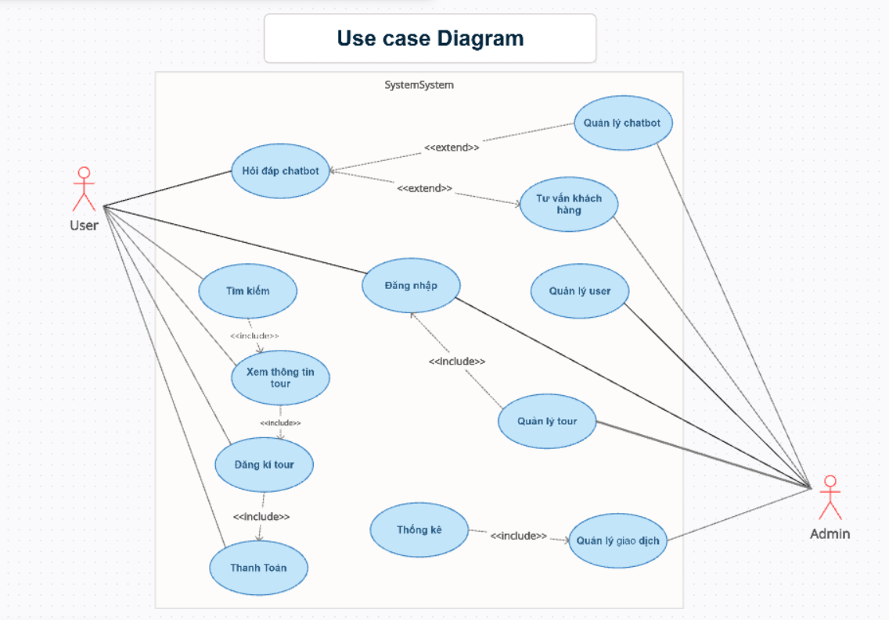
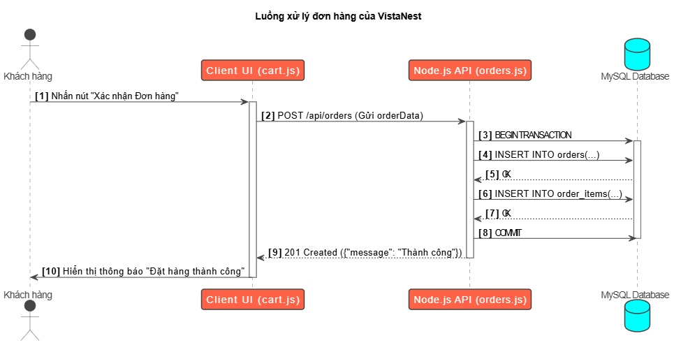
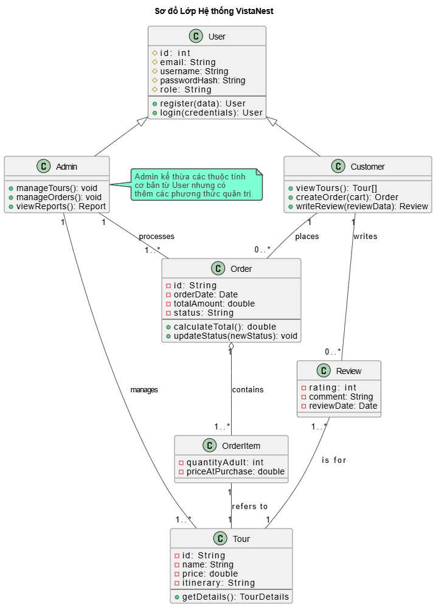
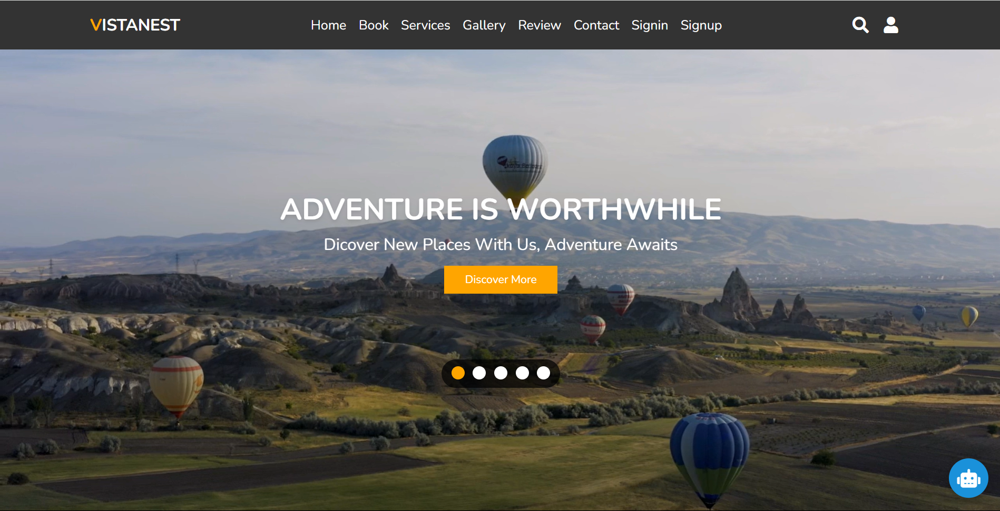
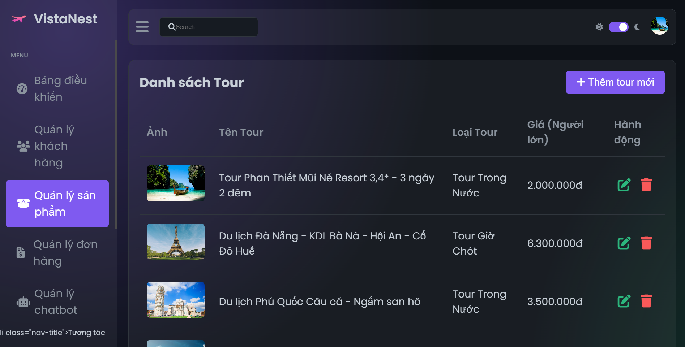

# ✈️ VistaNest Travels

> A travel website project created using **HTML, CSS and JavaScript, Python**.

🌐 **➡️ [Live Demo](https://nguyenthonhan.github.io/Service_Travel/client)

---
<h2>👥 Bảng phân chia công việc chi tiết của các thành viên trong nhóm theo từng tuần</h2>

<table border="1" cellspacing="0" cellpadding="6">
  <thead>
    <tr>
      <th>Tuần</th>
      <th>Nguyễn Thọ Nhân (23010786)</th>
      <th>Phạm Anh Thái (23010784)</th>
      <th>Hoàng Duy Sáng(23010481)</th>
      <th>Nguyễn Xuân Chức(23010452)</th>
    </tr>
  </thead>
  <tbody>
    <tr>
      <td>1</td>
      <td>💡 Chủ trì và thống nhất ý tưởng, mục tiêu, phạm vi dự án. 🔄 Phân công nhiệm vụ, tạo kho chung GitHub.</td>
      <td>🛠️ Thiết lập môi trường Git, cấu trúc thư mục dự án theo tài liệu đặc tả (SRS).</td>
      <td>📋 Phân tích yêu cầu hệ thống. ✍️ Góp phần tài liệu đặc tả.</td>
      <td>🗃️ Thiết kế lược đồ CSDL tourdb và các mối quan hệ.</td>
    </tr>
    <tr>
      <td>2</td>
      <td>🏛️ Thiết kế và phê duyệt kiến trúc hệ thống tổng tổng thể (Client, Server, AI). 🔍 Giám sát tiến độ nhóm.</td>
      <td>🔐 Lập trình API Xác thực (auth.js) – Đăng ký, đăng nhập, xác thực token.</td>
      <td>🎨 Góp giao diện trang chủ và chi tiết. 🛠️ Tối ưu code giao diện.</td>
      <td>✅ Viết và hoàn thiện script tạo database. 📄 Viết script thêm dữ liệu mẫu.</td>
    </tr>
    <tr>
      <td>3</td>
      <td>🔬 Nghiên cứu và tích hợp công nghệ. 📦 Thiết kế khung mô-đun (API – js).</td>
      <td>🔄 Lập trình API CRUD cho Tour, làm việc với CSDL.</td>
      <td>🧱 Code giao diện trang danh sách và trang chi tiết client.</td>
      <td>🔄 Lập trình API CRUD cho Khách hàng và Thanh toán.</td>
    </tr>
    <tr>
      <td>4</td>
      <td>🤖 Nghiên cứu và phát triển AI Chat Service (chat.js). 📡 Kết nối gợi ý từ OpenAI API.</td>
      <td>📦 Lập trình API Đơn hàng (orders.js) với transaction phức tạp.</td>
      <td>🧱 Code toàn bộ giao diện Trang Quản trị (Admin).</td>
      <td>⚙️ Xây dựng Chatbot hỗ trợ Gợi ý từ AI (chat.js).</td>
    </tr>
    <tr>
      <td>5</td>
      <td>🔗 Tích hợp hệ thống: kết nối Frontend và Backend. 🔐 Triển khai xác thực JWT.</td>
      <td>🏗️ Hỗ trợ Backend cho trang Quản lý Sản phẩm và Khách hàng.</td>
      <td>🎛️ Thiết kế giao diện Admin Dashboard. 🛠️ Hỗ trợ tối ưu UX.</td>
      <td>🏗️ Hỗ trợ kết nối các phần Quản lý & AI vào Admin.</td>
    </tr>
    <tr>
      <td>6</td>
      <td>🛡️ Tập trung bảo mật: - Mã hóa dữ liệu - Hạn chế quyền truy cập - Kiểm tra token & đăng nhập sai - JWT</td>
      <td>🔎 Kiểm thử API Backend và hiệu năng CSDL.</td>
      <td>🔍 Kiểm thử giao diện người dùng và hiệu năng phản hồi UI.</td>
      <td>🌐 Hoàn thiện UI Admin + CSS + Responsive.</td>
    </tr>
    <tr>
      <td>7</td>
      <td>🧠 Tổng hợp báo cáo toàn dự án: - Logic - Học thuật - Nhất quán</td>
      <td>🎤 Thiết kế slide PowerPoint cho buổi báo cáo.</td>
      <td>📝 Hỗ trợ viết chi tiết phần báo cáo.</td>
      <td>📝 Hỗ trợ viết chi tiết phần báo cáo.</td>
    </tr>
    <tr>
      <td>8</td>
      <td>🎙️ Thuyết trình, đóng gói sản phẩm cuối cùng.</td>
      <td>📄 Hoàn thiện README.md, hướng dẫn cài đặt.</td>
      <td>✅ Rà soát chính tả, định dạng toàn bộ tài liệu và slide.</td>
      <td>✅ Chuẩn bị câu hỏi Q&A có thể gặp khi bảo vệ.</td>
    </tr>
  </tbody>
</table>

---

## 📜 Tuyên bố Tầm nhìn và Sứ mệnh 

### 🚀 Tên dự án: VistaNest 

👉 Tầm nhìn (Vision): Trở thành nền tảng du lịch thông minh, đáng tin cậy hàng đầu, nơi mỗi hành trình của khách hàng đều được cá nhân hóa và hỗ trợ bởi công nghệ tiên tiến. 

👉 Sứ mệnh (Mission): Đơn giản hóa quá trình tìm kiếm và đặt tour du lịch thông qua một giao diện trực quan, đồng thời cung cấp các công cụ quản trị mạnh mẽ để tối ưu hóa hoạt động kinh doanh cho doanh nghiệp. 

---
## 📋 Phân tích Yêu cầu

### a. 🎯 Đặt vấn đề bài toán

Hệ thống **quản lý tour du lịch** giúp người dùng:
- Tìm kiếm tour du lịch
- Đăng ký và thanh toán trực tuyến một cách tiện lợi

Tích hợp thêm:
- 🤖 **Chatbot AI** hỗ trợ tư vấn, giải đáp thắc mắc
- 🧠 **Đăng nhập bằng nhận diện khuôn mặt** giúp tăng cường bảo mật và cá nhân hóa trải nghiệm

---

### b. 👥 Tác nhân (Actors)

- **👤 User (Khách hàng)**: sử dụng hệ thống để tra cứu, đăng ký tour
- **🛠️ Admin (Quản trị viên)**: quản lý hệ thống và tương tác với chatbot

---

### c. ⚙️ Phân tích chức năng theo tác nhân

#### 👉 User:
- Đăng nhập bằng khuôn mặt
- Tìm kiếm tour
- Xem thông tin chi tiết tour
- Đăng ký tour
- Thanh toán trực tuyến
- Hỏi đáp, nhận tư vấn từ chatbot AI

#### 👉 Admin:
- Quản lý danh sách tour (thêm/sửa/xoá)
- Quản lý người dùng
- Quản lý giao dịch, thống kê
- Cập nhật và quản lý chatbot AI
- Hỗ trợ tư vấn người dùng qua hệ thống chatbot

---

## 🛠️ Đặc tả và Thiết kế

### a. 📌 Use Case Diagram & Mô tả

Hệ thống gồm hai tác nhân chính: **User** và **Admin**.  
- **User**: có thể tìm kiếm tour, xem thông tin, đăng ký, thanh toán, và sử dụng chatbot.  
- **Admin**: có quyền quản lý tour, người dùng, chatbot, giao dịch và tư vấn khách hàng.

#### 🧩 Use Case Diagram

---

### b. 🔁 Flow (Activity Flow)

Sử dụng **Activity Diagram** để mô tả luồng xử lý đặt tour:

.

### c. 🧠 Class Diagram

Biểu đồ Lớp của hệ thống VistaNest:

.

## 🚀 Hướng Dẫn Chạy Chương Trình

📦 Khởi tạo Dự án và Cài đặt Thư viện: 

Mở terminal tại thư mục gốc của dự án. 

### Chạy lệnh npm install . 

🗃️ Thiết lập Cơ sở dữ liệu: 

Bước 2.1: Đảm bảo dịch vụ MySQL đang hoạt động. 

### Bước 2.2: node setupDatabase.js 

🚀 Khởi chạy các Dịch vụ Backend: 

Bước 3.1: Khởi chạy Core Service (Node.js): Mở một terminal mới, di chuyển vào thư mục server và chạy lệnh: 

### node index.js 

Kết quả mong đợi: Server chính lắng nghe trên cổng 3000 và kết nối thành công tới CSDL. 

Bước 3.2: Khởi chạy AI Service (Python): Mở một terminal khác, di chuyển vào thư mục chat và chạy lệnh: 

### python chat.py 

Kết quả mong đợi: Service chatbot lắng nghe trên cổng 5000, sẵn sàng nhận yêu cầu từ Core Service. 

🌐 Khởi chạy Giao diện Người dùng (Frontend): 

Mở một terminal cuối cùng, di chuyển vào thư mục client (hoặc travel) và sử dụng live-server để phục vụ các file tĩnh. 

live-server 

---
### 🚀 Lưu ý khi truy cập: 

🎤 Tài khoản Admin Demo: Để truy cập trang quản trị, vui lòng sử dụng thông tin đăng nhập sau: 

Username: admin 

Password: adminpassword 

---
### 🖼 Giao diện tiêu biểu:

.

.
